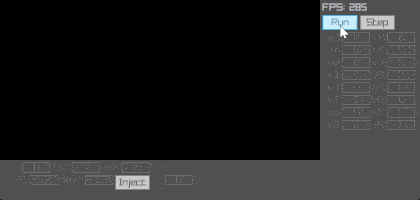

# Zip-8

Quick Chip-8 emulator written in Zig 0.13.0

To build, use `zig build` and run with `./zig-out/bin/zip-8 relative/path/to/rom` or `zig build run -- relative/path/to/rom`

Keys are mapped 1:1 to the Chip-8 keypad (eg: a=a, b=b, 1=1, 2=2, etc)

Left to implement:
- Sound
